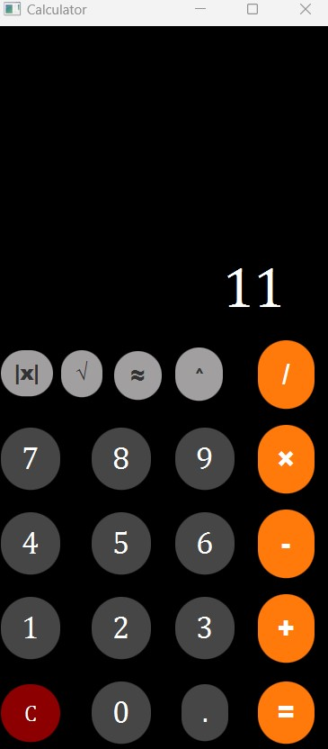

# JavaFX Calculator - Documentation

## 1. Project Overview

This project is a **JavaFX-based calculator** that supports both **basic arithmetic operations** and **advanced mathematical functions**. The graphical user interface (GUI) is designed using **FXML** for layout and **JavaFX** for handling events and user interactions.

### Features:
- **Basic operations**: Addition (`+`), Subtraction (`-`), Multiplication (`×`), Division (`/`), Power (`^`).
- **Advanced functions**: Square Root (`√`), Absolute Value (`|x|`), Rounding (`≈`).
- **Decimal support**: Allows input of floating-point numbers.
- **Clear button**: Resets the calculator.
- **Toggleable extra functions**: Additional functions are hidden by default and can be revealed with a button.

---

## 2. Design Choices and Challenges

### **Design Choices**
- **Modular Structure**: The project is separated into `Main.java`, `Controller.java`, and `view.fxml` for better maintainability.
- **User-Friendly Interface**: Buttons are arranged logically, and extra functions are hidden by default to keep the UI clean.
- **Event-Driven Approach**: JavaFX’s `onAction` handlers are used to respond to user interactions efficiently.

### **Challenges Encountered**
1. **Handling Floating-Point Precision**  
   - Floating-point calculations in Java can sometimes produce unexpected results (e.g., `0.1 + 0.2 ≠ 0.3` due to floating-point representation).  
   - The issue was mitigated by rounding results when necessary.

2. **Operator Precedence and Order of Operations**  
   - The initial implementation did not support chaining operations.  
   - A more structured approach was introduced to handle operations sequentially.

3. **Dynamically Toggling Extra Functions**  
   - Implementing a button to show/hide advanced functions required changes to the `FXML` file and the controller logic.

---

## 3. Algorithms and Data Structures Used

### **Algorithms**
- **Arithmetic Operations**: Implemented using Java’s `switch` expressions for clarity and efficiency.
- **Power Function (`^`)**: Uses `Math.pow(base, exponent)`, which is optimized for exponentiation.
- **Square Root (`√`)**: Uses `Math.sqrt(number)`, which implements the fast approximation algorithm.
- **Absolute Value (`|x|`)**: Uses `Math.abs(number)`, which checks for negative values and returns the positive equivalent.
- **Rounding (`≈`)**: Uses `Math.round(number)`, which rounds to the nearest integer.

### **Data Structures**
- **String for Display Storage**: The calculator stores user input as a `String` in the `TextField`, allowing easy manipulation of numbers.
- **Double for Numerical Computation**: All calculations are performed using `double` for precision.
- **Event Handling via JavaFX**: `Button` clicks trigger `onAction` methods, which process user inputs dynamically.

---

## 4. Improvements Made to the Initial Implementation

- **Improved UI/UX**  
  - Initially, all buttons were visible at once, which made the UI cluttered.  
  - Now, extra functions are hidden by default and can be toggled.

- **Enhanced Calculation Logic**  
  - The initial implementation only supported basic operations.  
  - Now, power, square root, absolute value, and rounding are included.

- **Better Handling of Edge Cases**  
  - Prevents multiple decimal points in a single number.  
  - Prevents division by zero (returns `0` instead of crashing).

---

### **Example Code: Operator Handling**
```java
@FXML
private void onOperatorClick(javafx.event.ActionEvent event) {
    String value = ((Button) event.getSource()).getText();
    if (!value.equals("=")) {
        if (!operator.isEmpty()) return;
        operator = value;
        num1 = Double.parseDouble(display.getText());
        display.setText("");
    } else {
        if (operator.isEmpty()) return;
        double num2 = Double.parseDouble(display.getText());
        double result = switch (operator) {
            case "+" -> num1 + num2;
            case "-" -> num1 - num2;
            case "×" -> num1 * num2;
            case "/" -> num2 != 0 ? num1 / num2 : 0;
            case "^" -> Math.pow(num1, num2);
            default -> 0;
        };
        display.setText(String.valueOf(result));
        operator = "";
        start = true;
    }
}

---

## 6. Additional Details

- **Why JavaFX?**  
  JavaFX provides a modern UI framework for Java applications and allows for easy UI customization with FXML.

- **Future Improvements**  
  - Implement parentheses for complex expressions.  
  - Add a history feature to view past calculations.  
  - Allow keyboard input for faster calculations.  

---

## 7. TEST
- First run the code in Calcultor.java
- 
- Then you wirte first number
- 
- After you write operatiion
- 
- You click to eqaul
- 
  

This documentation provides an overview of the **design, algorithms, challenges, and improvements** in this JavaFX calculator project. 🚀  
